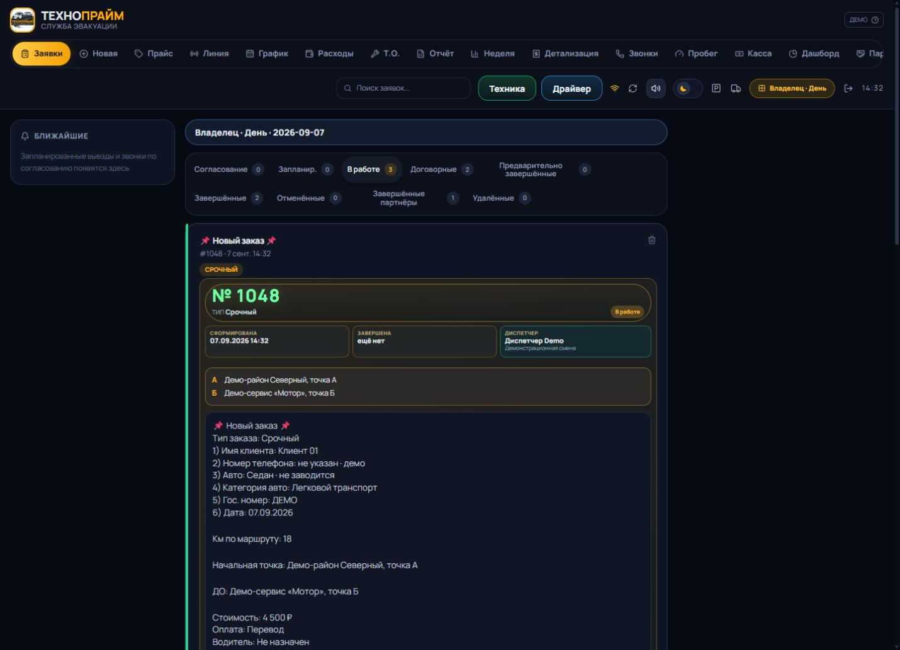

# Evacuation CRM · MELUWI

Интерактивная демоверсия CRM службы эвакуации: рабочее место диспетчера и мобильный интерфейс водителя.

[Открыть демо](https://evacuation-crm-demo.adapage1981.chatgpt.site) · [Подробный кейс](https://meluwi-portfolio.adapage1981.chatgpt.site/projects/evacuation) · [Связаться с автором](https://t.me/meluwis)



## Тестовый вход

Выберите **Диспетчер** или **Водитель**. Пароль для обеих ролей: **`meluwi-demo`**. Кнопка под полем подставляет его автоматически.

Это демонстрационный вход, а не система аутентификации. Пароль находится в клиентском коде и не защищает доступ. Не вводите реальные сведения. Данные синтетические, изменения сохраняются только в localStorage этого браузера. Для восстановления используйте «Сбросить демо».

## Что можно попробовать

1. Создать заявку с вымышленным маршрутом и стоимостью.
2. Назначить Водителя 01.
3. Начать рейс и завершить его с фактическим пробегом. Можно сменить роль на водителя: его задания сохранятся в том же браузере.
4. Проверить обновившийся одометр в автопарке и выручку в отчёте.
5. Добавить расход, отметить обслуживание, скачать CSV-отчёт.
6. Посмотреть журнал событий в разделе Telegram.
7. Завершить или отменить все активные заказы и закрыть смену.

Telegram-журнал является локальной симуляцией. Сообщения не отправляются, бот и рабочие чаты не подключены. Партнёрская доля 15% и интервал ТО 10 000 км — упрощённые правила демонстрации. Финансовый остаток показан до зарплат и налогов.

## Связь с исходным проектом

Исходный проект — CRM «Технопрайм» для службы эвакуации; около полутора месяцев разработки по данным автора. В локальных материалах подтверждены заявки, смены, касса, расходы, партнёры, пробег, обслуживание, Telegram-обработчики и отдельные Android-приложения диспетчера и водителя.

Этот репозиторий — **новая самостоятельная реализация демонстрационных сценариев**, подготовленная для портфолио. Это не выгрузка рабочей CRM и не её полная копия. В доступных локальных копиях исходники React были неполными, поэтому производственные бандлы не использованы в качестве публичного исходного кода.

Рабочий стек: React 19, TypeScript, Vite, Zustand, Framer Motion, PHP, SQLite, Node.js, Express, WebSocket, Capacitor, Firebase и Telegram. В проекте также есть Leaflet, jsPDF, html2canvas и интеграционные маршруты телефонии, Avito и Яндекс. Наличие в исходниках не означает, что все интеграции доступны в этой демоверсии.

Интерфейс пересобран по экранам оригинальной CRM: горизонтальное меню, фильтры статусов, подробные карточки заявок, оформление отчёта и отдельный кабинет водителя. Используются исходный логотип и Manrope (SIL OFL, лицензия в public/fonts/OFL.txt).

Демо: React 19, TypeScript, Vinext, Tailwind CSS, компоненты shadcn/Base UI. Серверная часть и реальные интеграции здесь отсутствуют. Все скриншоты сняты с этой демоверсии. Мобильные изображения показывают адаптивный веб-интерфейс, а не точное воспроизведение исходных Android APK.

## Локальный запуск

Требуется Node.js 22.13+ (рекомендуется актуальная версия Node.js 22 LTS) и npm.

```sh
npm ci
npm run dev
```

Адрес локального сервера: `http://127.0.0.1:4174`.

```sh
npm test
npx tsc --noEmit
npm run build
```

Статическая сборка находится в `dist/client`. Её можно разместить на статическом хостинге. Файл `.openai/hosting.json` связывает этот экземпляр с Sites; при самостоятельном развёртывании в другом аккаунте не используйте чужой `project_id`.

## Структура

- `app/model.ts` — типы, синтетический набор данных, переходы заявок и расчёты.
- `app/page.tsx` — экраны, формы и работа с локальным состоянием.
- `app/globals.css` — адаптивное оформление.
- `components/ui` — используемые UI-примитивы и их зависимости.
- `scripts/test-model.ts` — проверки бизнес-сценариев и ошибочных переходов.
- `docs/architecture.md` — устройство демо и границы относительно рабочего проекта.
- `public/screenshots` — снимки демоверсии без производственных данных.

## Проверки

Автоматически проверяются жизненный цикл заявки, защита от повторного завершения, учёт пробега, суммы отчёта, расходы, ТО, закрытие смены, восстановление повреждённого localStorage и сброс. В браузере проверены тестовый вход, выбор экипажа, создание и выполнение рейса, мобильная карточка, смена роли и скачивание CSV.

WebMCP: `get_demo_orders` читает доступные демонстрационной роли заявки, `open_demo_order` открывает карточку по ID. Проверены регистрация, успешный вызов и отказ для неизвестного заказа. В браузерах без WebMCP приложение работает обычным образом.

## Публичные данные

В репозиторий не переносились рабочие конфигурации, реальные IP-адреса, ключи, токены, личные данные, базы, дампы, номера клиентов, Telegram chat ID, исходные APK и ключи подписи. История репозитория начинается с демоверсии. Тестовый пароль намеренно публичный.
