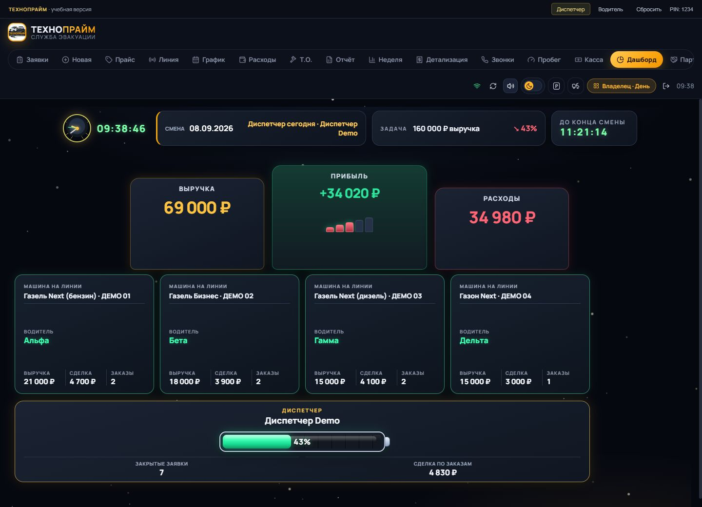

# Технопрайм CRM · MELUWI

CRM для службы эвакуации, над которой я работал около полутора месяцев. Сделал диспетчерскую, кабинет водителя и Android-приложения.

[Открыть демо](https://evacuation-crm-demo.adapage1981.chatgpt.site/) · [Портфолио](https://meluwi-portfolio.adapage1981.chatgpt.site/) · [Telegram](https://t.me/meluwis)



## Что сделал

- Заявки с маршрутами, назначением водителя, статусами и способами оплаты.
- Кабинет водителя: выход на линию, свои заказы, касса и топливо.
- График, отчёты за смену, учёт доходов и расходов.
- Автопарк, пробег и историю обслуживания машин.
- Уведомления о заказах и отчёты в рабочие чаты Telegram.
- Мобильные интерфейсы и приложения для Android.

## Стек рабочего проекта

React, TypeScript, Zustand, Framer Motion · PHP, SQLite, Node.js, Express, WebSocket · Capacitor, Firebase Notifications · Telegram Bot API.

## Демо

Можно создать заявку, назначить водителя и посмотреть отчёты. Роль переключается в верхней панели. Все данные тестовые, изменения остаются в браузере. Кнопка «Сбросить» возвращает примеры.

В репозитории — очищенная сборка оригинального интерфейса и отдельный демонстрационный API. Рабочий сервер, база и Android-сборки сюда не входят. Внешние интеграции отключены; демо не повторяет все серверные проверки и расчёты рабочей версии.

[Устройство демо](docs/architecture.md)

## Запуск

Node.js 22.13+.

```sh
npm ci
npm run dev
npm test
npm run build
```
